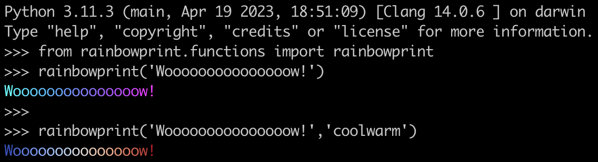

# rainbowprint

I built this repository as a template showing a simple installable Python package. The package can only do one (pretty useless) thing: apply a `matplotlib` color gradient to a string and print it to the screen. Example:

The most basic structure for the package to be installable is:

	rainbowprint/
	├── pyproject.toml
	└── src/
	    └── rainbowprint/
	        ├── __init__.py
	        └── functions.py

With just the soure code and a pyproject.toml file, the repository is already installable as a Python package. It will be the bare minimum though. Further down I list many things that can make a package better.

## Installation:

  	pip install git+https://github.com/TristanCantatGaudin/rainbowprint.git

Or, to install it in a fresh environment:

   	conda create -n someNewEnvName
   	conda activate someNewEnvName
   	conda install pip

and then go for `pip install...`

To test in one line that it worked, you can type:

	python -c "from rainbowprint.functions import rainbowprint; rainbowprint('This is a rainbow')"

## What is the pyproject.toml file?

This file contains some basic information about the package (e.g. name, version) but importantly lists dependencies (in the present case `matplotlib`, it will be automatically installed when you install `rainbowprint`) and the installation package (called a *build backend*) that `pip` (the *build frontend* tool) will rely on for the installation (here we chose `setuptools` as a build backend).

# Better
* README.md, LICENSE
* tests (at least import), pytest + workflow
* notebook example + compile workflow
* documentation (sphynx in repo, or readthedocs)
* pypi
